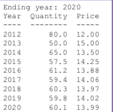

- [Review](#review)
  * [Format Output](#format-output)
  * [Read / Load files](#read---load-files)
  * [Data Structure](#data-structure)
  * [Metrics Calculation](#metrics-calculation)
  * [Functions Reminders](#functions-reminders)
  * [经典习题](#----)
  * [是不是闰年 leap year](#------leap-year)
- [Leetcode](#leetcode)
  * [1295 [Find Numbers with Even Number of Digits](https://leetcode.com/problems/find-numbers-with-even-number-of-digits)](#1295--find-numbers-with-even-number-of-digits--https---leetcodecom-problems-find-numbers-with-even-number-of-digits-)
  * [771 [ Jewels and Stones](https://leetcode.com/problems/jewels-and-stones)](#771---jewels-and-stones--https---leetcodecom-problems-jewels-and-stones-)
  * [1266 [ Minimum Time Visiting All Points](https://leetcode.com/problems/minimum-time-visiting-all-points)](#1266---minimum-time-visiting-all-points--https---leetcodecom-problems-minimum-time-visiting-all-points-)
  * [1290 [Convert Binary Number in a Linked List to Integer](https://leetcode.com/problems/convert-binary-number-in-a-linked-list-to-integer)](#1290--convert-binary-number-in-a-linked-list-to-integer--https---leetcodecom-problems-convert-binary-number-in-a-linked-list-to-integer-)
  * [709 [To Lower Case](https://leetcode.com/problems/to-lower-case)](#709--to-lower-case--https---leetcodecom-problems-to-lower-case-)

<small><i><a href='http://ecotrust-canada.github.io/markdown-toc/'>Table of contents generated with markdown-toc</a></i></small>

# Review

## Format Output

- how to format numbers in print

```python
print('{0:4d} {1:8.1f} {2:5.2f}'.format(year, qty, price))
```

- 输出右对齐

format 函数里面可以规定空几个格子


```python
print('{0:4d} {1:11.1f}'.format(i,initial)) 
```


- make user input a literal

default input is a string, unless we specify int() or float() in front of the function

```python
input = input('Enter your input')
```


- Two types of division:
  -  / operator performs **floating point division**
  -  // operator performs **integer division** 
    - Positive results truncated, negative rounded away from zero


- Conversion between letters and numbers

- ord()  change char to a number

- chr() change number to a character

```python
ord('C')
Out[139]: 67

chr(67)
Out[140]: 'C'
```


## Read / Load files

- 读取文件 with open

`open()`  
`with open(data, 'r') as f` 
区别主要是with相当于open的 try except finally 版本 在有error的情况下能够smooth的运行
`csv_reader` 可以直接把每一行按照comma来separate 你就不需要用split函数了

```python
def state_for_senator(file,name):
    result = ''
    with open(file,'r') as f:
      # 替换成 for line in csv.reader(f):
        for line in f: 
            line = line.split(',')
            if line[0].lower() == name.lower():
                result = line[1]
                
    return result
```

## Data Structure

- List Comprehension

```python
# case 1
for n in vals:
    if type(n) == int:
        squared_ints.append(n * n)
        
squared_ints = [n * n for n in vals if type(n) == int ]

# case 2
# 这个很神奇啊 list comprehension里面，如果只有if写后面 有if else 写前面
x = [i if i % 2 == 0 else 1 for i in range(10)]

# case 2
for row in matrix:
    for n in row:
        flattened.append(n)

flattened = [n for row in matrix for n in row]
```

要注意的是如果有if else的判断语句 逻辑顺序是 if -> for -> else 


## Metrics Calculation

- MAE Calculation

```python
# 一个算mae的例子
import numpy as np

x = [5,6,7,8,9]
y_a = [xi * 5 + 40 for xi in x]
y_i = [45,76,78,87,79]

error = []
for i in range(5):
    error.append(abs(y_a[i]-y_i[i]))

np.average(error)
```

## Functions Reminders

- **Splits(sep = None, Maxsplit = -1)**

  Default `sep = None` which refers to whitespace including tab, space, \n signs

- **Sum()**

  Sum can be used for merging **nested list**.

  Say if L is a nested list, we can create a new list by

  ```
  L2 = sum(L,[])
  ```

- Len()

  计算字符串长度。如果想要算数字长度，1 ， 23， 43214，是几位数，可以len(str(num))

- Map() [Link](https://www.runoob.com/python/python-func-map.html)

  

## 经典习题

## 是不是闰年 leap year

参考解法一 – 分段排除：
如果a % 4 ! = 0，则a不是闰年；
否则如果a % 100 == 0 && a % 400 != 0，则a不是闰年；
否则a是闰年。

参考解法二 – 列出所有闰年的可能条件，满足条件则为闰年，否则判为非闰年：
如果 (a % 400 == 0 || (a % 4 == 0 && a % 100 != 0)),  则a是闰年；否则 a不是闰年。

```python
yr = int(input('Enter year: '))
flag = True

# if this is leap year
if yr % 4 != 0:
    flag = False
elif yr % 100 == 0 and yr % 400 != 0:
    flag = False
    
if flag == True:
    print('{0:4d} is a leap year'.format(yr))
else:
    print('{0:4d} is not a leap year'.format(yr))
```


--------

# Leetcode

## 1295 [Find Numbers with Even Number of Digits](https://leetcode.com/problems/find-numbers-with-even-number-of-digits)  


这道题唯一要注意的大概就是，len(num) 是不可以的，数字是没有长度的，所以我们可以把数字先变成string，然后看string的长度


## 771 [ Jewels and Stones](https://leetcode.com/problems/jewels-and-stones)  


这道题很简单 不过参考答案里面有一个写法我之前不会 这里扩展一下知识

```python
def numJewelsInStones(self, J, S):
    return sum(map(S.count, J))      
```


我们是可以用 `count` 这个函数去数一个list/str/里面出现元素的次数的

## 1266 [ Minimum Time Visiting All Points](https://leetcode.com/problems/minimum-time-visiting-all-points)  


这道题我一开始还写了挺久的

但其实主要还是理解题意吧

```python

def minTimeToVisitAllPoints(self, points: List[List[int]]) -> int:
  count = 0
  for i in range(len(points)):
    if i+1 < len(points):
      # 右上角
      while points[i][0] < points[i+1][0] and points[i][1] < points[i+1][1]:
        points[i][0] += 1
        points[i][1] += 1
        count += 1
      # 左下角
      while points[i][0] > points[i+1][0] and points[i][1] > points[i+1][1]:
         count += 1
         points[i][0] -= 1
         points[i][1] -= 1
      # 左上角
      while points[i][0] > points[i+1][0] and points[i][1] < points[i+1][1]:
         count += 1
         points[i][0] -= 1
         points[i][1] += 1
      # 右下角
      while points[i][0] < points[i+1][0] and points[i][1] > points[i+1][1]:
         count += 1
         points[i][0] += 1
         points[i][1] -= 1
      # 同一水平/垂直
      count += abs(points[i][0]-points[i+1][0]) + abs(points[i][1]-points[i+1][1])
      return count
```

分类讨论的时间复杂度也会很高

其实两点之间这样 他们要挪动的点就是 xy坐标的绝对值的差值的最大值

```python
def minTimeToVisitAllPoints(self, points: List[List[int]]) -> int:
  count = 0
  for i in range(len(points)):
    if i+1 < len(points):
      count += max(abs(points[i][0]-points[i+1][0]),
                   abs(points[i][1]-points[i+1][1]))
	return count	
# 简化
return sum(max(abs(p[i][0] - p[i - 1][0]), 
               abs(p[i][1] - p[i - 1][1])) for i in range(1, len(p)))
```

其实，我觉得不要让i从0开始跑 因为i+1可能会超过边界。我们可以就从i = 1开始，然后用i-1表示上一个元素 会少一个判断条件 更加简便

## 1290 [Convert Binary Number in a Linked List to Integer](https://leetcode.com/problems/convert-binary-number-in-a-linked-list-to-integer)  

这道题暂时还搞不太懂

主要是要先稍微学习一下链表的用法 不然就不会啦


## 709 [To Lower Case](https://leetcode.com/problems/to-lower-case)  


**Solution**

```python
class Solution:
    def toLowerCase(self, str: str) -> str:
        return str.lower()
```

```python
class Solution:
    def toLowerCase(self, str: str) -> str:
        return ''.join((chr(ord(s)+32)) if ord(s)>=65 and ord(s) <=90 else s for s in str)
```

```python
class Solution:
    def toLowerCase(self, str: str) -> str:
        result = ''
        for s in str:
          if ord(s) >= 65 and ord(s) <= 90:
            result = result + (chr(ord(s) + 32))
          else:
            result = result + s
        return result
```

**Idea**

This question push you to think from `ASCII` rather than directly use built-in function.

You should know what `join` is used for <u>list concat</u>, if you want to concat string, just use <u>operator `"+"`</u>

And there is a example of `join`

