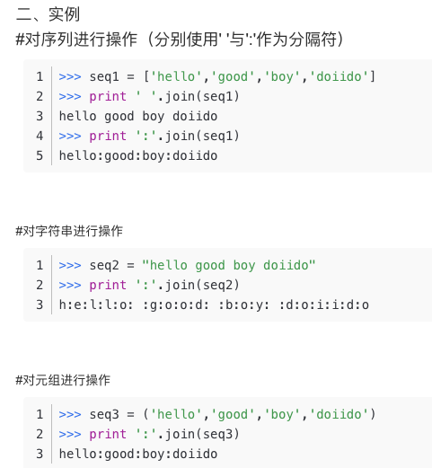

#### Leetcode Algorithm 709

**Question**

Implement function ToLowerCase() that has a string parameter str, and returns the same string in 

 **Example 1:**

```
Input: "Hello"
Output: "hello"
```

**Example 2:**

```
Input: "here"
Output: "here"
```

**Example 3:**

```
Input: "LOVELY"
Output: "lovely"
```

**Solution**

```python
class Solution:
    def toLowerCase(self, str: str) -> str:
        return str.lower()
```

```python
class Solution:
    def toLowerCase(self, str: str) -> str:
        return ''.join((chr(ord(s)+32)) if ord(s)>=65 and ord(s) <=90 else s for s in str)
```

```python
class Solution:
    def toLowerCase(self, str: str) -> str:
        result = ''
        for s in str:
          if ord(s) >= 65 and ord(s) <= 90:
            result = result + (chr(ord(s) + 32))
          else:
            result = result + s
        return result
```

**Idea**

This question push you to think from `ASCII` rather than directly use built-in function.


You should know what `join` is used for <u>list concat</u>, if you want to concat string, just use <u>operator `"+"`</u>

And there is a example of `join`



