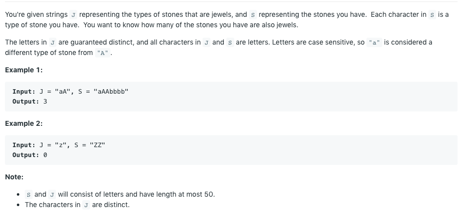
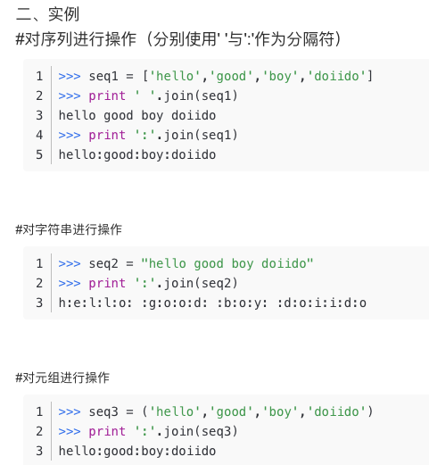

# Content

-------

- [Leetcode](#leetcode)
  * [1295 Find Numbers with Even Number of Digits](#1295-find-numbers-with-even-number-of-digits)
  * [771 Jewels and Stones](#771-jewels-and-stones)
  * [1266 Minimum Time Visiting All Points](#1266-minimum-time-visiting-all-points)
  * [1290 Convert Binary Number in a Linked List to Integer](#1290-convert-binary-number-in-a-linked-list-to-integer)
  * [709 To Lower Case](#709-to-lower-case)

---

## 1295 Find Numbers with Even Number of Digits


这道题唯一要注意的大概就是，len(num) 是不可以的，数字是没有长度的，所以我们可以把数字先变成string，然后看string的长度


## 771 Jewels and Stones



这道题很简单 不过参考答案里面有一个写法我之前不会 这里扩展一下知识

```
def numJewelsInStones(self, J, S):
    return sum(map(S.count, J))      

def minTimeToVisitAllPoints(self, points: List[List[int]]) -> int:
  count = 0
  for i in range(len(points)):
    if i+1 < len(points):
      # 右上角
      while points[i][0] < points[i+1][0] and points[i][1] < points[i+1][1]:
        points[i][0] += 1
        points[i][1] += 1
        count += 1
      # 左下角
      while points[i][0] > points[i+1][0] and points[i][1] > points[i+1][1]:
         count += 1
         points[i][0] -= 1
         points[i][1] -= 1
      # 左上角
      while points[i][0] > points[i+1][0] and points[i][1] < points[i+1][1]:
         count += 1
         points[i][0] -= 1
         points[i][1] += 1
      # 右下角
      while points[i][0] < points[i+1][0] and points[i][1] > points[i+1][1]:
         count += 1
         points[i][0] += 1
         points[i][1] -= 1
      # 同一水平/垂直
      count += abs(points[i][0]-points[i+1][0]) + abs(points[i][1]-points[i+1][1])
      return count
def minTimeToVisitAllPoints(self, points: List[List[int]]) -> int:
  count = 0
  for i in range(len(points)):
    if i+1 < len(points):
      count += max(abs(points[i][0]-points[i+1][0]),
                   abs(points[i][1]-points[i+1][1]))
  return count  
# 简化
return sum(max(abs(p[i][0] - p[i - 1][0]), 
               abs(p[i][1] - p[i - 1][1])) for i in range(1, len(p)))
class Solution:
    def toLowerCase(self, str: str) -> str:
        return str.lower()
class Solution:
    def toLowerCase(self, str: str) -> str:
        return ''.join((chr(ord(s)+32)) if ord(s)>=65 and ord(s) <=90 else s for s in str)
class Solution:
    def toLowerCase(self, str: str) -> str:
        result = ''
        for s in str:
          if ord(s) >= 65 and ord(s) <= 90:
            result = result + (chr(ord(s) + 32))
          else:
            result = result + s
        return result
```



And there is a example of `join`

You should know what `join` is used for list concat, if you want to concat string, just use operator `"+"`

This question push you to think from `ASCII` rather than directly use built-in function.

**Idea**

**Solution**


## 709 To Lower Case


主要是要先稍微学习一下链表的用法 不然就不会啦

这道题暂时还搞不太懂

## 1290 Convert Binary Number in a Linked List to Integer

其实，我觉得不要让i从0开始跑 因为i+1可能会超过边界。我们可以就从i = 1开始，然后用i-1表示上一个元素 会少一个判断条件 更加简便

其实两点之间这样 他们要挪动的点就是 xy坐标的绝对值的差值的最大值

分类讨论的时间复杂度也会很高

但其实主要还是理解题意吧

这道题我一开始还写了挺久的


## 1266 Minimum Time Visiting All Points

我们是可以用 `count` 这个函数去数一个list/str/里面出现元素的次数的

