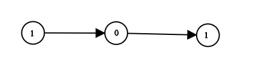

#### Leetcode Algorithm 1290

**question**

Given `head` which is a reference node to a singly-linked list. The value of each node in the linked list is either 0 or 1. The linked list holds the binary representation of a number.

Return the *decimal value* of the number in the linked list.

 

**Example 1:**



```
Input: head = [1,0,1]
Output: 5
Explanation: (101) in base 2 = (5) in base 10
```

**Example 2:**

```
Input: head = [0]
Output: 0
```

**Example 3:**

```
Input: head = [1]
Output: 1
```

**Example 4:**

```
Input: head = [1,0,0,1,0,0,1,1,1,0,0,0,0,0,0]
Output: 18880
```

**Example 5:**

```
Input: head = [0,0]
Output: 0
```

 

**Constraints:**

- The Linked List is not empty.
- Number of nodes will not exceed `30`.
- Each node's value is either `0` or `1`.


```python
# Definition for singly-linked list.
# class ListNode:
#     def __init__(self, x):
#         self.val = x
#         self.next = None
```

**Solution**

```python
class Solution:
    def getDecimalValue(self, head: ListNode) -> int:
#         因为这不是list 而是链表 linked-list, 所以不能直接遍历 不能直接len
        # return sum( 2**i if head[i] == 1 else 0 for i in range(len(head))) 
        # ans = 0
        # while head: 
        #     ans = 2*ans + head.val 
        #     head = head.next 
        # return ans 
        
        ans = 0 
        i=0
        while head:
            ans += head.val * 2**i
            head = head.next
            i+=1
        return ans    
```

**Idea**

Not familiar with linked-list (链表). Will learn later...