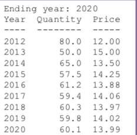

# Contents

-----

- [Review](#review)
  * [Format Output](#format-output)
  * [Read / Load files](#read---load-files)
  * [Data Structure](#data-structure)
  * [Metrics Calculation](#metrics-calculation)
  * [Functions Reminders](#functions-reminders)
  * [经典习题](#----)
  * [是不是闰年 leap year](#------leap-year)

# Review

## Format Output

- how to format numbers in print

```python
print('{0:4d} {1:8.1f} {2:5.2f}'.format(year, qty, price))
```

- 输出右对齐

format 函数里面可以规定空几个格子


```python
print('{0:4d} {1:11.1f}'.format(i,initial)) 
```


- make user input a literal

default input is a string, unless we specify int() or float() in front of the function

```python
input = input('Enter your input')
```


- Two types of division:
  -  / operator performs **floating point division**
  -  // operator performs **integer division** 
    - Positive results truncated, negative rounded away from zero


- Conversion between letters and numbers

- ord()  change char to a number

- chr() change number to a character

```python
ord('C')
Out[139]: 67

chr(67)
Out[140]: 'C'
```


## Read / Load files

- 读取文件 with open

`open()`  
`with open(data, 'r') as f` 
区别主要是with相当于open的 try except finally 版本 在有error的情况下能够smooth的运行
`csv_reader` 可以直接把每一行按照comma来separate 你就不需要用split函数了

```python
def state_for_senator(file,name):
    result = ''
    with open(file,'r') as f:
      # 替换成 for line in csv.reader(f):
        for line in f: 
            line = line.split(',')
            if line[0].lower() == name.lower():
                result = line[1]
                
    return result
```

## Data Structure

### List

- List Comprehension

```python
# case 1
for n in vals:
    if type(n) == int:
        squared_ints.append(n * n)
        
squared_ints = [n * n for n in vals if type(n) == int ]

# case 2
# 这个很神奇啊 list comprehension里面，如果只有if写后面 有if else 写前面
x = [i if i % 2 == 0 else 1 for i in range(10)]

# case 2
for row in matrix:
    for n in row:
        flattened.append(n)

flattened = [n for row in matrix for n in row]
```

要注意的是如果有if else的判断语句 逻辑顺序是 if -> for -> else 

-  `Append`

  a.append(3) ☑️

  a = a.append(3) ❌


## Metrics Calculation

- MAE Calculation

```python
# 一个算mae的例子
import numpy as np

x = [5,6,7,8,9]
y_a = [xi * 5 + 40 for xi in x]
y_i = [45,76,78,87,79]

error = []
for i in range(5):
    error.append(abs(y_a[i]-y_i[i]))

np.average(error)
```

## Functions Reminders

- **Splits(sep = None, Maxsplit = -1)**

  Default `sep = None` which refers to whitespace including tab, space, \n signs

- **Sum()**

  Sum can be used for merging **nested list**.

  Say if L is a nested list, we can create a new list by

  ```
  L2 = sum(L,[])
  ```

- **Len()**

  计算字符串长度。如果想要算数字长度，1 ， 23， 43214，是几位数，可以len(str(num))

- **Map()** [Link](https://www.runoob.com/python/python-func-map.html)

- **Reverse()**

  `list(reverse(a_list))` can return the reversed list, or you can use `a_list.reverse()`
  
  

## 经典习题

## 是不是闰年 leap year

参考解法一 – 分段排除：
如果a % 4 ! = 0，则a不是闰年；
否则如果a % 100 == 0 && a % 400 != 0，则a不是闰年；
否则a是闰年。

参考解法二 – 列出所有闰年的可能条件，满足条件则为闰年，否则判为非闰年：
如果 (a % 400 == 0 || (a % 4 == 0 && a % 100 != 0)),  则a是闰年；否则 a不是闰年。

```python
yr = int(input('Enter year: '))
flag = True

# if this is leap year
if yr % 4 != 0:
    flag = False
elif yr % 100 == 0 and yr % 400 != 0:
    flag = False
    
if flag == True:
    print('{0:4d} is a leap year'.format(yr))
else:
    print('{0:4d} is not a leap year'.format(yr))
```


--------

