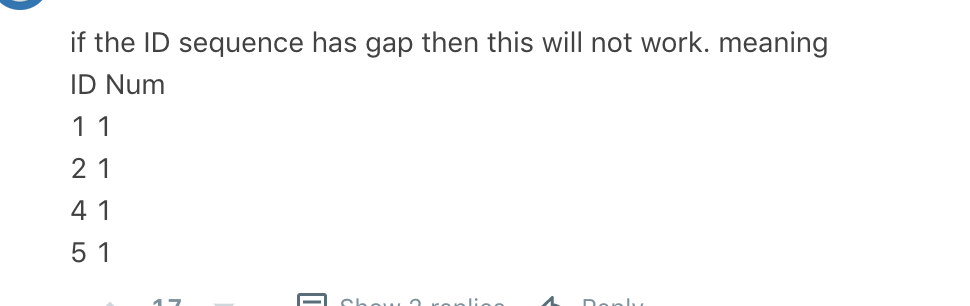

### 180 Consecutive Numbers

Write a SQL query to find all numbers that appear at least three times consecutively.

```
+----+-----+
| Id | Num |
+----+-----+
| 1  |  1  |
| 2  |  1  |
| 3  |  1  |
| 4  |  2  |
| 5  |  1  |
| 6  |  2  |
| 7  |  2  |
+----+-----+
```

For example, given the above `Logs` table, `1` is the only number that appears consecutively for at least three times.

```
+-----------------+
| ConsecutiveNums |
+-----------------+
| 1               |
+-----------------+
```


**Solution**

```mysql
# 成功答案
SELECT  DISTINCT L1.Num AS "ConsecutiveNums"
  FROM  Logs AS L1
  JOIN  Logs AS L2 ON L1.Id + 1 = L2.Id
  JOIN  Logs AS L3 ON L1.Id + 2 = L3.Id
  # 可别傻瓜的写什么连等哦，， L1.Num = L2.Num = L3.Num 这简直傻孩子 每一个条件都要分开的！用and连接
 WHERE  L1.Num = L2.Num 
   AND  L1.Num = L3.Num
```


```mysql
# 这样子不写join直接l1 l2 l3就是对表进行笛卡尔积， Cartesian product
Select DISTINCT l1.Num 
  from Logs l1, 
  		 Logs l2,
       Logs l3 
 where l1.Id=l2.Id-1 and l2.Id=l3.Id-1 # 和join的on一个意思 
   and l1.Num=l2.Num and l2.Num=l3.Num 
```

上面两种答案可能会作用的很好

但是如果id是有gap的

比如



那就没办法找到对应答案了

我暂时想到的是可以用window function 去做

```mysql
with cte as
(
select num, row_number() over (partition by Num order by Num) as ConsecutiveNums
from Logs
)
select Num
from cte
where ConsecutiveNums>=3
```

