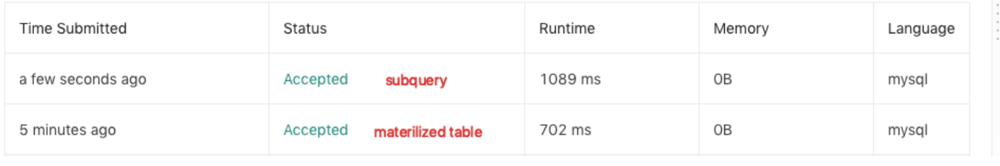

### 181 [ Employees Earning More Than Their Managers](https://leetcode.com/problems/employees-earning-more-than-their-managers)  

The `Employee` table holds all employees including their managers. Every employee has an Id, and there is also a column for the manager Id.

```
+----+-------+--------+-----------+
| Id | Name  | Salary | ManagerId |
+----+-------+--------+-----------+
| 1  | Joe   | 70000  | 3         |
| 2  | Henry | 80000  | 4         |
| 3  | Sam   | 60000  | NULL      |
| 4  | Max   | 90000  | NULL      |
+----+-------+--------+-----------+
```

Given the `Employee` table, write a SQL query that finds out employees who earn more than their managers. For the above table, Joe is the only employee who earns more than his manager.

```
+----------+
| Employee |
+----------+
| Joe      |
+----------+
```


**Solution**


```mysql
# materilized table
SELECT  E1.Name As Employee
  FROM  Employee AS Employee
  JOIN  Employee AS Manager ON E1.ManagerId = E2.Id
 WHERE  E1.Salary > E2.Salary

# subquery
SELECT  T.name AS Employee
  FROM  (SELECT  E1.*, 
                (SELECT E2.Salary
                   FROM Employee AS E2 
                  WHERE E2.id = E1.ManagerId) AS S2
           FROM  Employee AS E1) AS T
 WHERE T.Salary > T.S2
```


可以看出这一次 materialised table会更快

