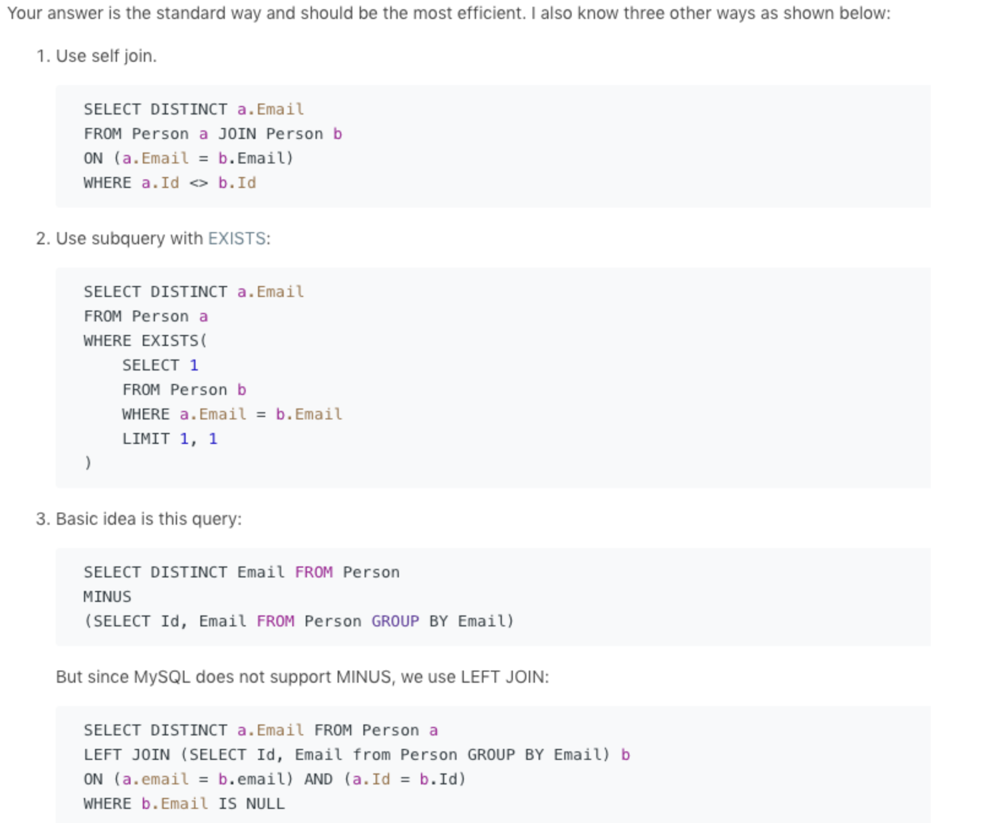

### 182 Duplicate Emails

Write a SQL query to find all duplicate emails in a table named `Person`.

```
+----+---------+
| Id | Email   |
+----+---------+
| 1  | a@b.com |
| 2  | c@d.com |
| 3  | a@b.com |
+----+---------+
```

For example, your query should return the following for the above table:

```
+---------+
| Email   |
+---------+
| a@b.com |
+---------+
```

**Note**: All emails are in lowercase.


**Solution**

这道题的确是easy中的easy了 我倒是没有什么特别要说的

我的code是

```mysql
SELECT Email FROM(
SELECT  Email, COUNT(*) AS wc
  FROM  person
 GROUP  BY Email
HAVING  wc > 1) AS T 
```

不过稍微efficient的写法 是可以省去subquery的

```mysql
select Email
  from Person
 group by Email
having count(Email) > 1;
```

更多元的解法[在这](https://leetcode.com/problems/duplicate-emails/discuss/53528/I-have-this-Simple-Approach-anybody-has-some-other-way)



甚至懒得打字了hhhh

​	mysql 不支持两表的差，也就是不支持*MINUS*的操作，是可以通过left join去simulate的

？？？？

# 最后一个解法暂时有点没看懂哈。。回头再看看