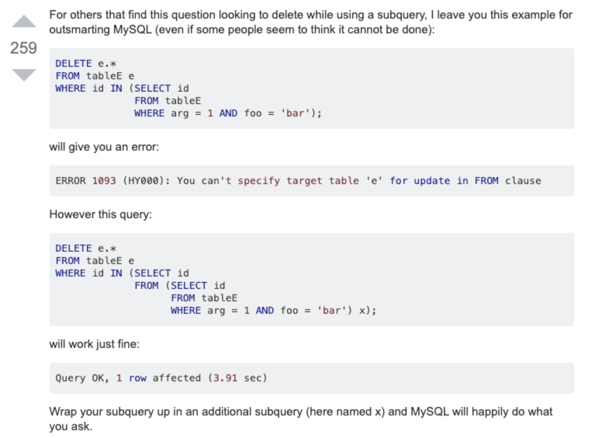

### 196 [ Delete Duplicate Emails](https://leetcode.com/problems/delete-duplicate-emails) **

Write a SQL query to **delete** all duplicate email entries in a table named `Person`, keeping only unique emails based on its *smallest* **Id**.

```
+----+------------------+
| Id | Email            |
+----+------------------+
| 1  | john@example.com |
| 2  | bob@example.com  |
| 3  | john@example.com |
+----+------------------+
Id is the primary key column for this table.
```

For example, after running your query, the above `Person` table should have the following rows:

```
+----+------------------+
| Id | Email            |
+----+------------------+
| 1  | john@example.com |
| 2  | bob@example.com  |
+----+------------------+
```

**Note:**

Your output is the whole `Person` table after executing your sql. Use `delete` statement.


**Solution**

首先是这道题的解法

```mysql
# 要在delete 和 from中间加上表名
Delete  P1 FROM Person AS P1 
  JOIN  Person AS P2 ON P1.Email = P2.Email
 WHERE  P1.Id > P2.id
 
# 解法2 要注意 mysql在delete的时候不能在where中引用被删除的表。但是只要再套一个select就可以 
DELETE FROM Person WHERE Id NOT IN 
(SELECT * FROM(
    SELECT MIN(Id) FROM Person GROUP BY Email) as p);
    
# 解法2的错误版本,但是只要再套一个select应该就可以了
DELETE FROM Person
    WHERE Id IN
    (SELECT P1.Id FROM Person AS P1, Person AS P2 
	     WHERE P1.Id > P2.Id AND P1.Email = P2.Email);
```

因为LC不支持window function，如果支持的话。我觉得可以用rownumber 然后partition by email，最后我们只保留rownumber = 1的那些。结合with cte as (select ...) 的语句

-------

这道题交了一些delete相关的语法

首先 最基本的delete用法是，也不需要delete * 啊什么的，delete column 更是不存在 要删就是一行直接删除了

```mysql
DELETE FROM `table_name` [WHERE condition];
```

但是如果你删除的条件based on 多表连接呢？I mean A JOIN B where cond XXX

**Correct**

```mysql
DELETE a1, a2 FROM t1 AS a1 INNER JOIN t2 AS a2
WHERE a1.id=a2.id;

DELETE FROM a1, a2 USING t1 AS a1 INNER JOIN t2 AS a2
WHERE a1.id=a2.id;
```

**Incorrect**

```mysql
DELETE t1 AS a1, t2 AS a2 FROM t1 INNER JOIN t2
WHERE a1.id=a2.id;

DELETE FROM t1 AS a1, t2 AS a2 USING t1 INNER JOIN t2
WHERE a1.id=a2.id;
```

你要在delete和from中间加上删除的表的别名。

------

另外，MySQL does not allow the table you're deleting from be used in a subquery for the condition. [参考说明](https://stackoverflow.com/questions/4471277/mysql-delete-from-with-subquery-as-condition)) 即



