# SQL Knowledge

## Join VS Subquery

Answer quoted from [mysql](https://dev.mysql.com/doc/refman/5.7/en/rewriting-subqueries.html): 


A LEFT [OUTER] JOIN can be faster than an equivalent subquery because the server might be able to optimize it better—a fact that is not specific to MySQL Server alone. Prior to SQL-92, outer joins did not exist, so subqueries were the only way to
do certain things. Today, MySQL Server and many other modern database systems offer a wide range of outer join types.

Answer quoted from [Stackoverflow](https://stackoverflow.com/questions/2577174/join-vs-sub-query):


For me, I'll say that subquery looks easier, more readable and understandable versus join. And you should keep in mind that there might be **duplicate** records while using join query. So you should always keep cautious. 


---

# SQL LeetCode

## 175 [Combine Two Tables](https://leetcode.com/problems/combine-two-tables)


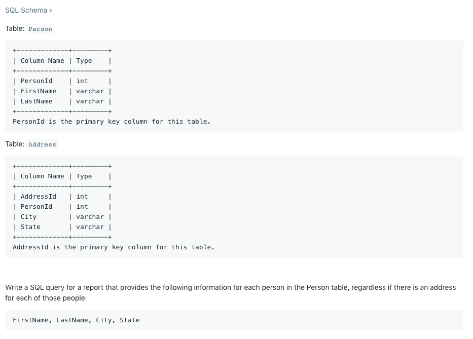


## 176 [Second Highest Salary](https://leetcode.com/problems/second-highest-salary)  *

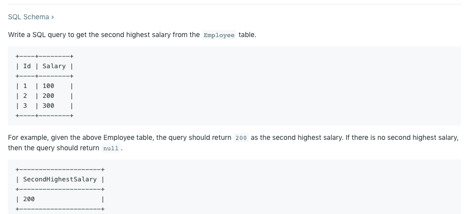


首先，关于limit的用法，平时limit你会用的。这里就是可以学会limit,offset

```mysql
select column limit a,b
```

他会从a+1行开始，选取b行的数据

比如

```mysql
select column limit 2,3
```

就会选出 3,4,5 这三行。

这道题有一个比较容易陷入陷阱的地方就是，如果记录是，100，100，其实是没有secondHighest的。以及100,100,200, 200, 第二大是100.如果你order by，会选到200.因为你没有**distinct**

所以我们一定要加上distinct

```mysql
# sample answer
SELECT
    (SELECT DISTINCT
            Salary
        FROM
            Employee
        ORDER BY Salary DESC
     # 写成 limit 1,1 也是一样的 和offset是一个道理
        LIMIT 1 OFFSET 1) AS SecondHighestSalary
```


## 177 [Nth Highest Salary](https://leetcode.com/problems/nth-highest-salary)  *


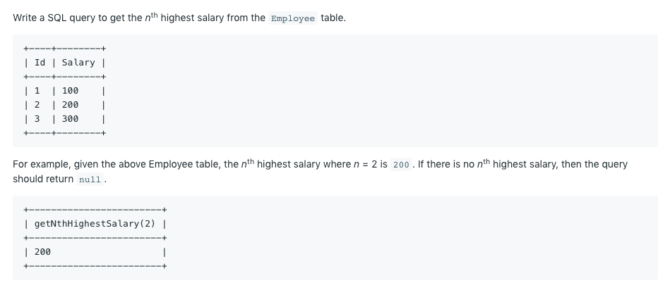

和上面176是一道题 这里的话要学习一下怎么写mysql的function

```mysql
CREATE FUNCTION function_name [ (parameter datatype [, parameter datatype]) ]
RETURNS return_datatype

BEGIN

   declaration_section

   executable_section

END;
```


```mysql
# Sample answer
# limit后面不能直接写N-1，他只接受数字。所以先定义一个M等于N-1，这种虚拟变量定义之前一半需要先declare。
CREATE FUNCTION getNthHighestSalary(N INT) RETURNS INT
BEGIN
  DECLARE M INT;
  SET M = N-1;
  RETURN (
      # Write your MySQL query statement below.
      SELECT 
      IFNULL((SELECT DISTINCT Salary FROM Employee ORDER BY Salary DESC LIMIT M,1),NULL) AS getNthHighestSalary
  );
END
```


瞎默写语法结构 万一哪一天面试官叫你写一个function怎么办呢是吧

CREATE FUNCTION xxx(year DATETIME) RETURNS INT

BEGIN

DECLARE X INT;

SET X = M -1 ;

RETURN (SELECT./....)

END

## 595 BigCountries

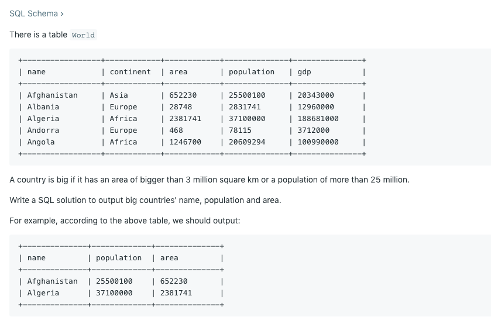

**Why `Union` is faster than `OR`?**

Strictly speaking, Using `UNION` is faster when it comes to cases like **scan two different column like this**.

(Of course using `UNION ALL` is much faster than `UNION` since we don't need to sort the result. But it violates the requirements)

Suppose we are searching `population` and `area`, Given that MySQL usually uses one one index per table in a given query, so when it uses the 1st index rather than 2nd index, it would still have to do a table-scan to find rows that fit the 2nd index.

When using `UNION`, each sub-query can use the index of its search, then combine the sub-query by `UNION`

**Sequence of OR**

Did you pay attention to order of conditions in a where clause?
<u>OR does not need to check second part if the first is true. What is means? - Put more likely true condition first and see</u>

**Difference between UNION ALL and UNION**

- UNION ALL keep duplicate rows while UNION remove duplicate rows


## 178 [Rank Scores](https://leetcode.com/problems/rank-scores) **

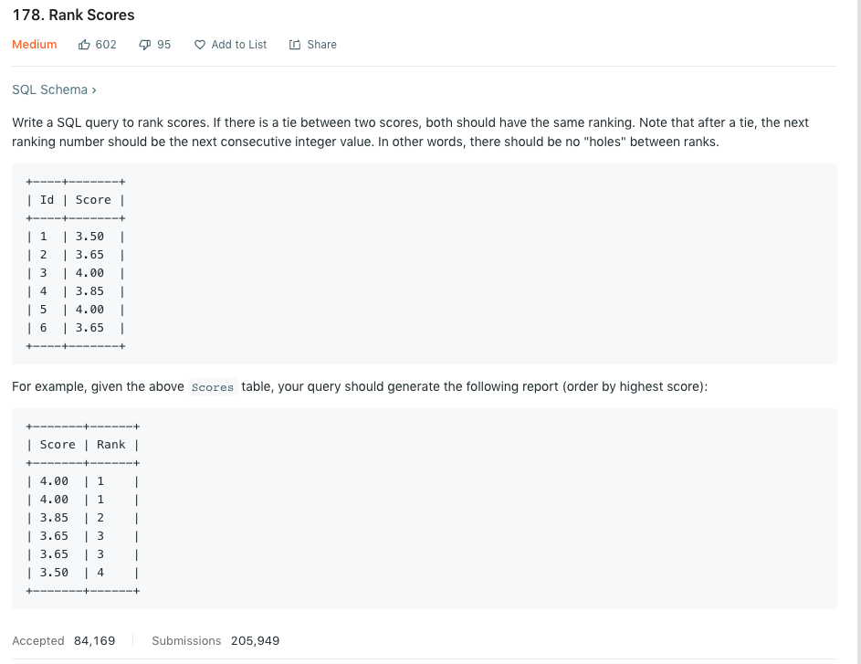

首先吐槽 LC不支持window func，就还挺麻烦的

这道题真的很妙 给到了我一些关于rank的新的想法。ken上课时候也有要求我们使用w/o window func去解决问题 但是感觉这道题更精简吧 把思路给显示出来了。

首先明确 题目要求有tie的话是一个rank，下一次的rank+1没有skip，也就是*dense_rank*

[Sample Answers](https://leetcode.com/problems/rank-scores/discuss/53094/Simple-Short-Fast)

下面对答案进行分析和探讨

```mysql
SELECT
  Score,
  @rank := @rank + (@prev <> (@prev := Score)) Rank
FROM
  Scores,
  (SELECT @rank := 0, @prev := -1) init
ORDER BY Score desc
```

这样的写法我肯定是写不出来的。大概就是scores 和 两个session variable(SS) 作为一张新的表，然后开始select，

一开始rank=0，prev=-1， 如果prev score和当下的score一样，那么返回0，不一样返回1。所以每一次新的一行记录会和之前的比。如果是相同的score，rank就没有变，不一样的score，rank就+1了

prev的值在每一次比较的时候去改变 太骚啦！

----

解法2

这个解法更加舒适让我好理解一些

```mysql
# subquery 的写法
SELECT
  Score,
  (SELECT count(distinct Score) FROM Scores WHERE Score >= s.Score) Rank
FROM Scores s
ORDER BY Score desc
# materialized table
# 不过为什么这里是group by id我还有点无解 但感觉上应该是找那个 可以unique identify一行记录的column
SELECT s.Score, 
			 count(distinct t.score) Rank
	FROM Scores s 
	JOIN Scores t ON s.Score <= t.score
 GROUP BY s.Id
 ORDER BY s.Score desc
```

原理非常简单 大概就是同样的两张表 一张S一张T，我们join后只留下 比自己score大的那些records，数一下究竟有几条呢。。。把这个作为rank就好

-----

拓展。

题目现在要求是dense rank的写法，如果说要求rank的写法了怎么办 [解法](https://stackoverflow.com/questions/46856267/implement-rank-without-using-analytic-function)

```mysql
# >= 改成 > 号，count(distinct 表2.score) 改成 (count *) 
SELECT
  Score,
  (SELECT count(*) + 1 FROM Scores WHERE Score > s.Score) Rank
FROM Scores s
ORDER BY Score desc
```

如果要求row_number的写法呢？

```mysql
这个暂时没有理解投 看stackoverflow的好
```


## 180[ Consecutive Numbers](https://leetcode.com/problems/consecutive-numbers)  

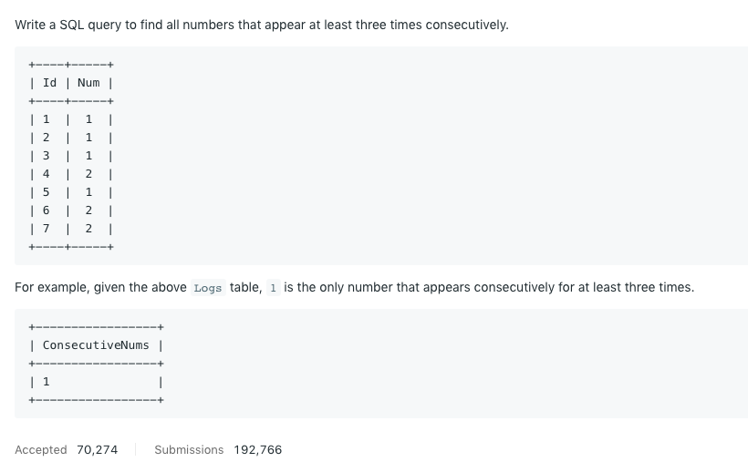

```mysql
# 成功答案
SELECT  DISTINCT L1.Num AS "ConsecutiveNums"
  FROM  Logs AS L1
  JOIN  Logs AS L2 ON L1.Id + 1 = L2.Id
  JOIN  Logs AS L3 ON L1.Id + 2 = L3.Id
  # 可别傻瓜的写什么连等哦，， L1.Num = L2.Num = L3.Num 这简直傻孩子 每一个条件都要分开的！用and连接
 WHERE  L1.Num = L2.Num 
   AND  L1.Num = L3.Num
```


```mysql
# 这样子不写join直接l1 l2 l3就是对表进行笛卡尔积， Cartesian product
Select DISTINCT l1.Num 
  from Logs l1, 
  		 Logs l2,
       Logs l3 
 where l1.Id=l2.Id-1 and l2.Id=l3.Id-1 # 和join的on一个意思 
   and l1.Num=l2.Num and l2.Num=l3.Num 
```

上面两种答案可能会作用的很好

但是如果id是有gap的

比如

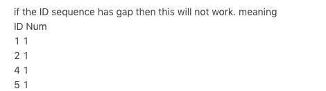

那就没办法找到对应答案了

我暂时想到的是可以用window function 去做

```mysql
with cte as
(
select num, row_number() over (partition by Num order by Num) as ConsecutiveNums
from Logs
)
select Num
from cte
where ConsecutiveNums>=3
```


## 181 [ Employees Earning More Than Their Managers](https://leetcode.com/problems/employees-earning-more-than-their-managers)  

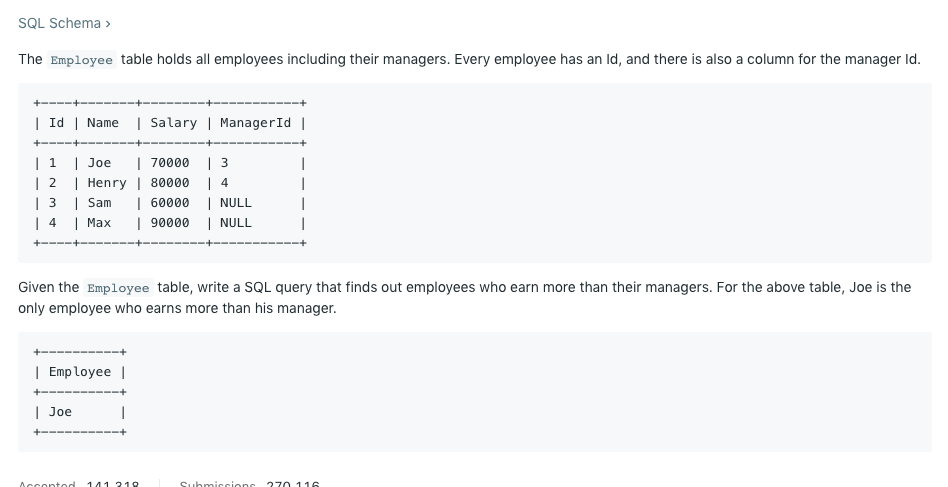


```mysql
# materilized table
SELECT  E1.Name As Employee
  FROM  Employee AS E1
  JOIN  Employee AS E2 ON E1.ManagerId = E2.Id
 WHERE  E1.Salary > E2.Salary

# subquery
SELECT  T.name AS Employee
  FROM  (SELECT  E1.*, 
                (SELECT E2.Salary
                   FROM Employee AS E2 
                  WHERE E2.id = E1.ManagerId) AS S2
           FROM  Employee AS E1) AS T
 WHERE T.Salary > T.S2
```


可以看出这一次 materialised table会更快

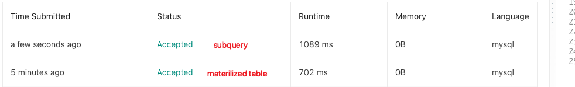


## 181 [Duplicate Emails](https://leetcode.com/problems/duplicate-emails)  

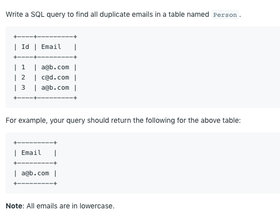

这道题的确是easy中的easy了 我倒是没有什么特别要说的

我的code是

```mysql
SELECT Email FROM(
SELECT  Email, COUNT(*) AS wc
  FROM  person
 GROUP  BY Email
HAVING  wc > 1) AS T 
```

不过稍微efficient的写法 是可以省去subquery的

```mysql
select Email
  from Person
 group by Email
having count(Email) > 1;
```

更多元的解法[在这](https://leetcode.com/problems/duplicate-emails/discuss/53528/I-have-this-Simple-Approach-anybody-has-some-other-way)

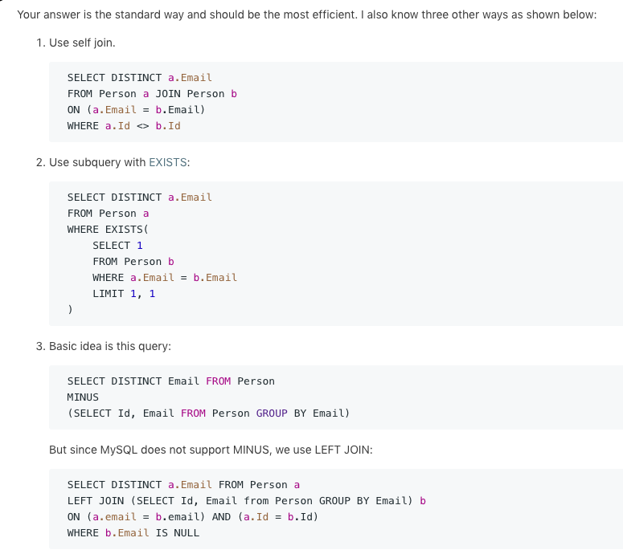

甚至懒得打字了hhhh

​	mysql 不支持两表的差，也就是不支持*MINUS*的操作，是可以通过left join去simulate的

？？？？

# 最后一个解法暂时有点没看懂哈。。回头再看看

## 183 [ Customers Who Never Order](https://leetcode.com/problems/customers-who-never-order)  

Too easy and too lazy to summarize

## 184 [Department Highest Salary](https://leetcode.com/problems/department-highest-salary) *

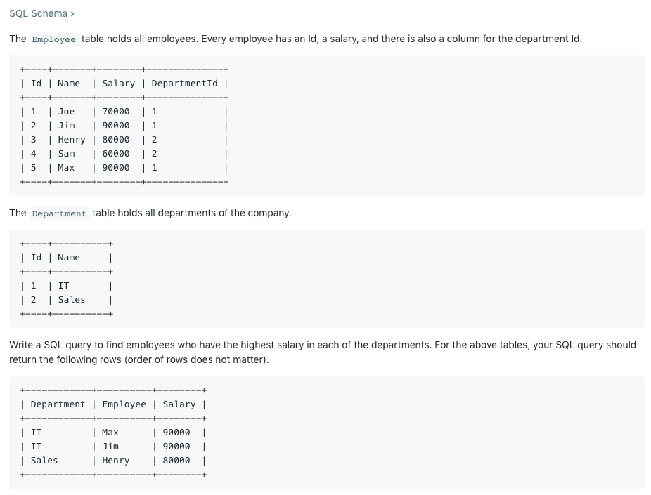

解法

```mysql
# 我现在做题目有点依赖于 rank去做了，渐渐忽视了max 和 min的写法
SELECT  Department, Name AS Employee , Salary FROM (
SELECT  E1.Name, E1.Salary,
        (SELECT  COUNT(DISTINCT E2.Salary) FROM Employee AS E2
          WHERE E2.DepartmentId = E1.DepartmentId
            AND  E2.Salary >= E1.Salary) AS Rank,
        D.name AS Department
  FROM  Employee AS E1
  JOIN  Department AS D ON D.Id = E1.DepartmentId
 ORDER  BY E1.Salary,E1.DepartmentId DESC) AS T
 WHERE  Rank = 1
 
# 首先找到max-salary，然后让salary等于max_salary 就可以。这样会比较快。
# subquery写也可以，但是应该是materilised table比较快
SELECT  D.name AS Department, E.Name AS Employee, E.Salary
  FROM  Employee AS E
  JOIN  Department AS D ON D.Id = E.Departmentid
  JOIN  (SELECT  DepartmentId, MAX(salary) AS max_s
          FROM  Employee 
         GROUP  BY DepartmentId) AS T ON T.Departmentid = E.Departmentid
 WHERE  T.max_s = E.Salary
```

两种解法。解法一是我最近特别喜欢去尝试写的写法 可以在不用window function的情况下去写rank，去掉=号和变成1+count(*) 就是rank，如上写法就是dense_rank。

但是这种max / min的题 其实用解法二会更好，直接找到max/min salary然后对原表进行join。学习！、

就我现在经验看来 解法12有不同的使用场景

1. **解法一适合于选择top N，比如top3 top 2这种 有rank会方便很多**
2. **解法二适合于top1，max or min都是可以的！每个月分组的最大最小值你就直接max + group by就好**

----

另外 我以为一直以为，where ID in (SELECT ID FROM XXX) 这种约束条件肯定是只有一个column的，今天才知道原来多column筛选也是可以的。

```mysql
SELECT D.Name AS Department ,E.Name AS Employee ,E.Salary 
from 
	Employee E,
	Department D 
WHERE E.DepartmentId = D.id 
# 可以多个column同时进行匹配
  AND (DepartmentId,Salary) in 
  (SELECT DepartmentId,max(Salary) as max FROM Employee GROUP BY DepartmentId)
```

185 就是184的变题


## 185 [Department Top Three Salaries](https://leetcode.com/problems/department-top-three-salaries) 

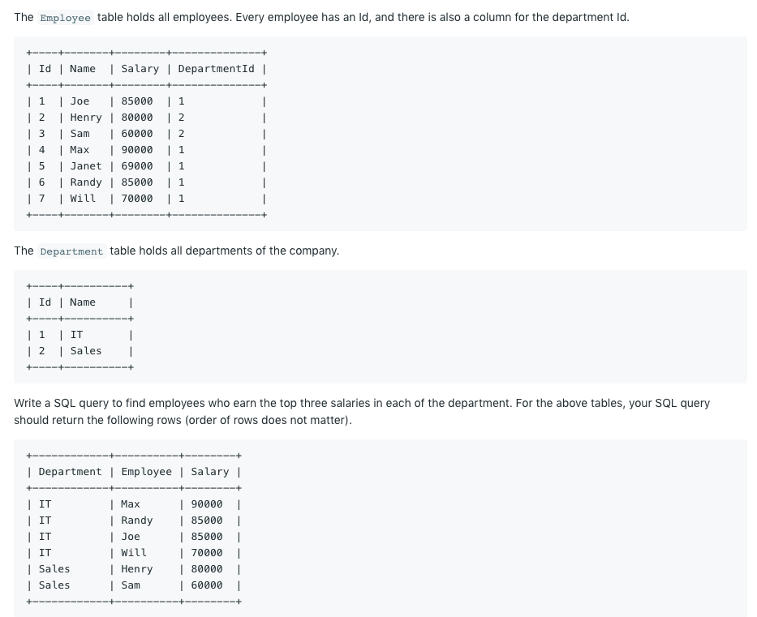


```mysql
# 184里复制来的code
SELECT  Department, Name AS Employee , Salary FROM (
SELECT  E1.Name, E1.Salary,
        (SELECT  COUNT(DISTINCT E2.Salary) FROM Employee AS E2
          WHERE E2.DepartmentId = E1.DepartmentId
            AND  E2.Salary >= E1.Salary) AS Rank,
        D.name AS Department
  FROM  Employee AS E1
  JOIN  Department AS D ON D.Id = E1.DepartmentId
 ORDER  BY E1.Salary,E1.DepartmentId DESC) AS T
 WHERE  Rank <= 3
 
# if you have access to dense_rank()
select d.Name as Department, a. Name as Employee, a. Salary 
from (
select e.*, dense_rank() over (partition by DepartmentId order by Salary desc) as DeptPayRank 
from Employee e 
) a 
join Department d
on a. DepartmentId = d. Id 
where DeptPayRank <=3; ```
```


## 196 [ Delete Duplicate Emails](https://leetcode.com/problems/delete-duplicate-emails) **


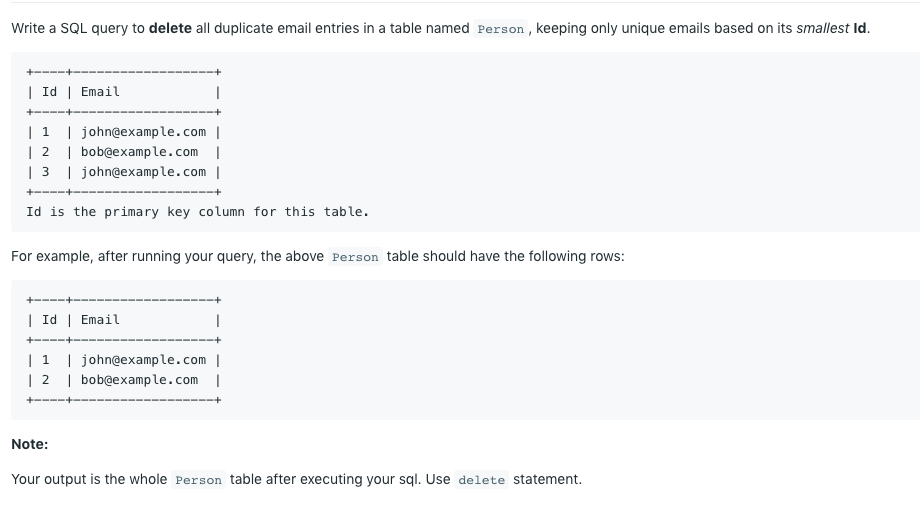

首先是这道题的解法

```mysql
# 要在delete 和 from中间加上表名
Delete  P1 FROM Person AS P1 
  JOIN  Person AS P2 ON P1.Email = P2.Email
 WHERE  P1.Id > P2.id
 
# 解法2 要注意 mysql在delete的时候不能在where中引用被删除的表。但是只要再套一个select就可以 
DELETE FROM Person WHERE Id NOT IN 
(SELECT * FROM(
    SELECT MIN(Id) FROM Person GROUP BY Email) as p);
    
# 解法2的错误版本,但是只要再套一个select应该就可以了
DELETE FROM Person
    WHERE Id IN
    (SELECT P1.Id FROM Person AS P1, Person AS P2 
	     WHERE P1.Id > P2.Id AND P1.Email = P2.Email);
```

因为LC不支持window function，如果支持的话。我觉得可以用rownumber 然后partition by email，最后我们只保留rownumber = 1的那些。结合with cte as (select ...) 的语句

-------

这道题交了一些delete相关的语法

首先 最基本的delete用法是，也不需要delete * 啊什么的，delete column 更是不存在 要删就是一行直接删除了

```mysql
DELETE FROM `table_name` [WHERE condition];
```

但是如果你删除的条件based on 多表连接呢？I mean A JOIN B where cond XXX

**Correct**

```mysql
DELETE a1, a2 FROM t1 AS a1 INNER JOIN t2 AS a2
WHERE a1.id=a2.id;

DELETE FROM a1, a2 USING t1 AS a1 INNER JOIN t2 AS a2
WHERE a1.id=a2.id;
```

**Incorrect**

```mysql
DELETE t1 AS a1, t2 AS a2 FROM t1 INNER JOIN t2
WHERE a1.id=a2.id;

DELETE FROM t1 AS a1, t2 AS a2 USING t1 INNER JOIN t2
WHERE a1.id=a2.id;
```

你要在delete和from中间加上删除的表的别名。

------

另外，MySQL does not allow the table you're deleting from be used in a subquery for the condition. [参考说明](https://stackoverflow.com/questions/4471277/mysql-delete-from-with-subquery-as-condition)) 即

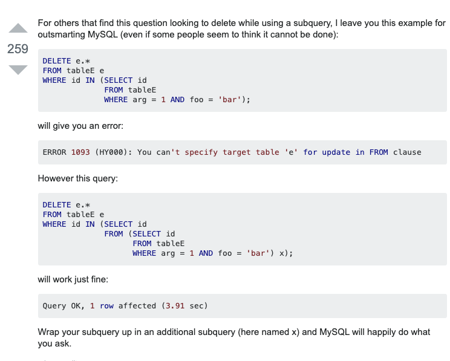


## 197 [Rising Temperature](https://leetcode.com/problems/rising-temperature)  

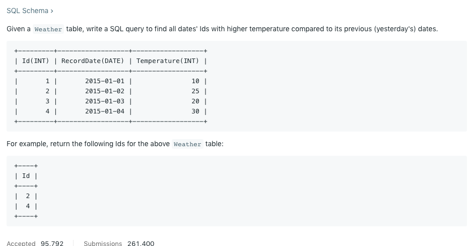

解法

```mysql
# 这道题错了好多次 主要问题是因为连接的时候，我们比较的是日期 不能直接给日期+1/-1，所以是需要用一些函数的

SELECT  distinct w1.Id as Id
  FROM  Weather AS w1
  JOIN  Weather AS w2 ON w1.RecordDate = Date_Add(w2.RecordDate,INTERVAL 1 DAY)
  WHERE W1.Temperature > w2.Temperature
```

**日期函数**

- DATE_ADD(Date, Interval Unit)
- TO_DAYS(Date)
- DATEDIFF(DATE1,DATE2)


## 262 [Trips and Users](https://leetcode.com/problems/trips-and-users) **

The `Trips` table holds all taxi trips. Each trip has a unique Id, while Client_Id and Driver_Id are both foreign keys to the Users_Id at the `Users` table. Status is an ENUM type of (‘completed’, ‘cancelled_by_driver’, ‘cancelled_by_client’).

```
+----+-----------+-----------+---------+--------------------+----------+
| Id | Client_Id | Driver_Id | City_Id |        Status      |Request_at|
+----+-----------+-----------+---------+--------------------+----------+
| 1  |     1     |    10     |    1    |     completed      |2013-10-01|
| 2  |     2     |    11     |    1    | cancelled_by_driver|2013-10-01|
| 3  |     3     |    12     |    6    |     completed      |2013-10-01|
| 4  |     4     |    13     |    6    | cancelled_by_client|2013-10-01|
| 5  |     1     |    10     |    1    |     completed      |2013-10-02|
| 6  |     2     |    11     |    6    |     completed      |2013-10-02|
| 7  |     3     |    12     |    6    |     completed      |2013-10-02|
| 8  |     2     |    12     |    12   |     completed      |2013-10-03|
| 9  |     3     |    10     |    12   |     completed      |2013-10-03| 
| 10 |     4     |    13     |    12   | cancelled_by_driver|2013-10-03|
+----+-----------+-----------+---------+--------------------+----------+
```

The `Users` table holds all users. Each user has an unique Users_Id, and Role is an ENUM type of (‘client’, ‘driver’, ‘partner’).

```
+----------+--------+--------+
| Users_Id | Banned |  Role  |
+----------+--------+--------+
|    1     |   No   | client |
|    2     |   Yes  | client |
|    3     |   No   | client |
|    4     |   No   | client |
|    10    |   No   | driver |
|    11    |   No   | driver |
|    12    |   No   | driver |
|    13    |   No   | driver |
+----------+--------+--------+
```

Write a SQL query to find the cancellation rate of requests made by unbanned users (both client and driver must be unbanned) between **Oct 1, 2013** and **Oct 3, 2013**. The cancellation rate is computed by dividing the number of canceled (by client or driver) requests made by unbanned users by the total number of requests made by unbanned users.

For the above tables, your SQL query should return the following rows with the cancellation rate being rounded to *two* decimal places.

```
+------------+-------------------+
|     Day    | Cancellation Rate |
+------------+-------------------+
| 2013-10-01 |       0.33        |
| 2013-10-02 |       0.00        |
| 2013-10-03 |       0.50        |
+------------+-------------------+
```

解法

觉得很神奇的是 数数不一定要有count，可以用sum case when的写法

```mysql
SELECT Request_at as Day, 
       ROUND(SUM(CASE WHEN Status LIKE 'cancelled%' THEN 1 ELSE 0 END) / 
             COUNT(*), 2) as "Cancellation Rate"
FROM(
    SELECT * FROM Trips t
    WHERE
        t.Client_Id not in (select Users_Id from Users where Banned = 'Yes') AND
        t.Driver_Id not in (select Users_Id from Users where Banned = 'Yes') AND
        t.Request_at between '2013-10-01' and '2013-10-03'
    ) AS newT
GROUP BY Request_at


SELECT Trips.Request_at Day,
       round(sum(if(status != 'completed', 1, 0)) / 
             sum(1), 2) 'Cancellation Rate'
FROM Trips
JOIN Users AS U1
  ON Trips.Client_Id = U1.Users_Id
JOIN Users AS U2
  ON Trips.Driver_Id = U2.Users_Id
WHERE U1.Banned = 'No'
  AND U2.Banned = 'No'
  AND Trips.Request_at between '2013-10-01' AND '2013-10-03'   
GROUP BY Trips.Request_at
```


# Questions

## 178 Rank Scores - Solved

题目现在要求是dense rank的写法，如果说要求rank的写法了怎么办

[解法](https://stackoverflow.com/questions/46856267/implement-rank-without-using-analytic-function)
